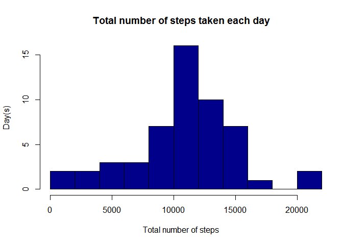
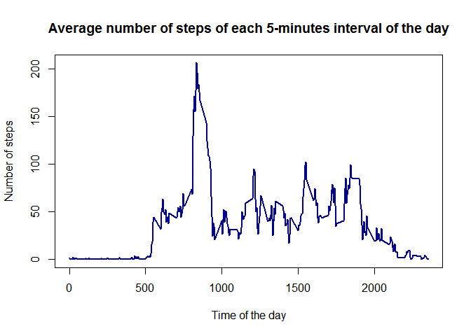
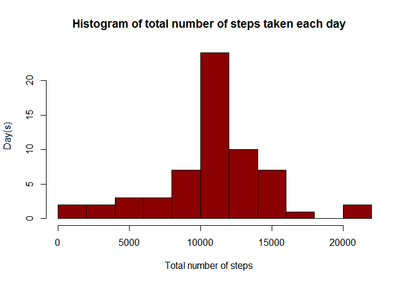

# Reproducible Research: Peer Assessment 1


## Loading and preprocessing data
1. Loading data

```r
rd <- read.csv(unz("activity.zip", "activity.csv"),na.strings = "NA")
```


## What is mean total number of steps taken per day?
1. Histogram of the total number of steps taken each day

```r
rd_day <- aggregate(rd[1], rd[2], sum)
xmin <- min(rd_day[2],na.rm=TRUE)
xmax <- max(rd_day[2],na.rm=TRUE)
xt <- "Total number of steps"
yt <- "Day(s)"
mt <- "Total number of steps taken each day" 
hist(rd_day[is.na(rd_day[2])==FALSE,2], breaks="fd",xlim=c(xmin, xmax), 
     main = mt, xlab= xt, ylab=yt, col="Dark Blue")
```

 


2. the mean and median total number of steps taken per day

```r
mn <- as.integer(mean(rd_day$steps, na.rm=TRUE))
md <- as.integer(median(rd_day$steps, na.rm=TRUE))
md
```

[1] 10765
Mean is **10766** and Median is **10765**  

## What is the average daily activity pattern?
1. A time series plot of the 5-minute interval (x-axis) and the average number of steps taken, averaged across all days (y-axis)

```r
rd_time <- aggregate(rd[1], rd[3], mean, na.rm=TRUE)
xt <- "Time of the day"
yt <- "Number of steps"
mt <- "Average number of steps of each 5-minutes interval of the day" 
plot(rd_time[,1], rd_time[,2], type='l',main = mt, xlab= xt, ylab=yt
     ,col = "dark blue", lwd = 2)
```

 

2. Which 5-minute interval, on average across all the days in the dataset, contains the maximum number of steps?

```r
maxtime <- rd_time[rd_time[2]==max(rd_time[2]),1]
maxtime <- sprintf("%02d:%02d", as.numeric(maxtime) %/% 100, as.numeric(maxtime) %% 60)
```
**08:55** contains the maximum numbers of steps   


## Imputing missing values
1. Calculate the total number of missing values in the dataset

```r
NAs <- nrow(rd[is.na(rd[1])==TRUE,])
TN <- nrow(rd[,])
```
Total number of missing values is **2304** out of **17568**

2. Devise a strategy for filling in all of the missing values in the dataset.

- **Use the mean for 5-minute interval to impute missing values**

3. Create a new dataset that is equal to the original dataset but with the missing data filled in.


```r
## to impute use the average of each 5 minutes 
## round to decimal point because the number of steps data is Integer
library(data.table)
rd_time2 <- cbind(rd_time[1], round(rd_time[2]))
dt_time <-as.data.table(rd_time2)
dt <-as.data.table(rd)
setkey(dt_time, interval)
setkey(dt, interval)
##Merged data frame data
ipdata <- as.data.frame(merge(dt, dt_time))
##update NA data with the average
ipdata[is.na(ipdata[2])==TRUE,2] <- ipdata[is.na(ipdata[2])==TRUE,4]
```

4. Histogram of the total number of steps taken each day and Calculate and report the mean and median total number of steps taken per day. 

```r
ip_day <- aggregate(ipdata[2], ipdata[3], sum)
xmin <- min(ip_day[2])
xmax <- max(ip_day[2])
xt <- "Total number of steps"
yt <- "Day(s)"
mt <- "Histogram of total number of steps taken each day" 
names(ip_day) = c("date", "steps")
hist(ip_day[,2], breaks="fd",xlim=c(xmin, xmax), 
     main = mt, xlab= xt, ylab=yt, col="Dark Red")
```

 

```r
## mean and median after imputing
imn <- as.integer(mean(ip_day$steps))
imd <- as.integer(median(ip_day$steps))
```

Mean is **10765** and Median is **10762**  
(Before imputing, Mean is **10766** and Median is **10765**)  


5. Do these values differ from the estimates from the first part of the assignment? What is the impact of imputing missing data on the estimates of the total daily number of steps?

**There is no significant difference of Mean and Median between before imputing and after imputing. As well, the shape of Histogram is very alike. There is no impact of imputing NA values by using the mean of steps for 5-minute interval.**


## Are there differences in activity patterns between weekdays and weekends?
1. Create a new factor variable in the dataset with two levels - "weekday" and "weekend" indicating whether a given date is a weekday or weekend day.

```r
ip_week <- cbind(ip_day,weekdays(as.Date(ip_day[,1])))
ip_week2 <- cbind(ip_week, ifelse(!weekdays(as.Date(ip_day[,1])) %in% c("Saturday", "Sunday"), "weekday","weekend"))
names(ip_week2) <- c("date", "Steps", "dayofweek", 'week')

## set weekday or weekend to imputed data
dt2 <- as.data.table(ipdata[1:3])
setkey(dt2, date)
dt_ip2 <- as.data.table(ip_week2[c(1,4)])
dt_ip <- as.data.frame(merge(dt2, dt_ip2))
```


2. Make a panel plot containing a time series plot of the 5-minute interval (x-axis) and the average number of steps taken, averaged across all weekday days or weekend days (y-axis).

```r
## calculate steps by interval and weekday or weekend
library(ggplot2)
dt_time_week <- aggregate(dt_ip[3], c(dt_ip[4],dt_ip[2]), mean)
xt <- "Time of the day"
yt <- "Number of steps"
mt <- "Average number of steps of \neach 5-minutes interval of the day"
names(dt_time_week) = c("week", "interval", "steps")
ggplot(dt_time_week, aes(interval, steps,col=week)) + facet_wrap(~week,nrow=2) + geom_line(aes(group=week)) + labs(x=xt, y= yt, title =mt) + theme(legend.position = "none") + scale_color_manual(values = c("black", "red"))
```

 
